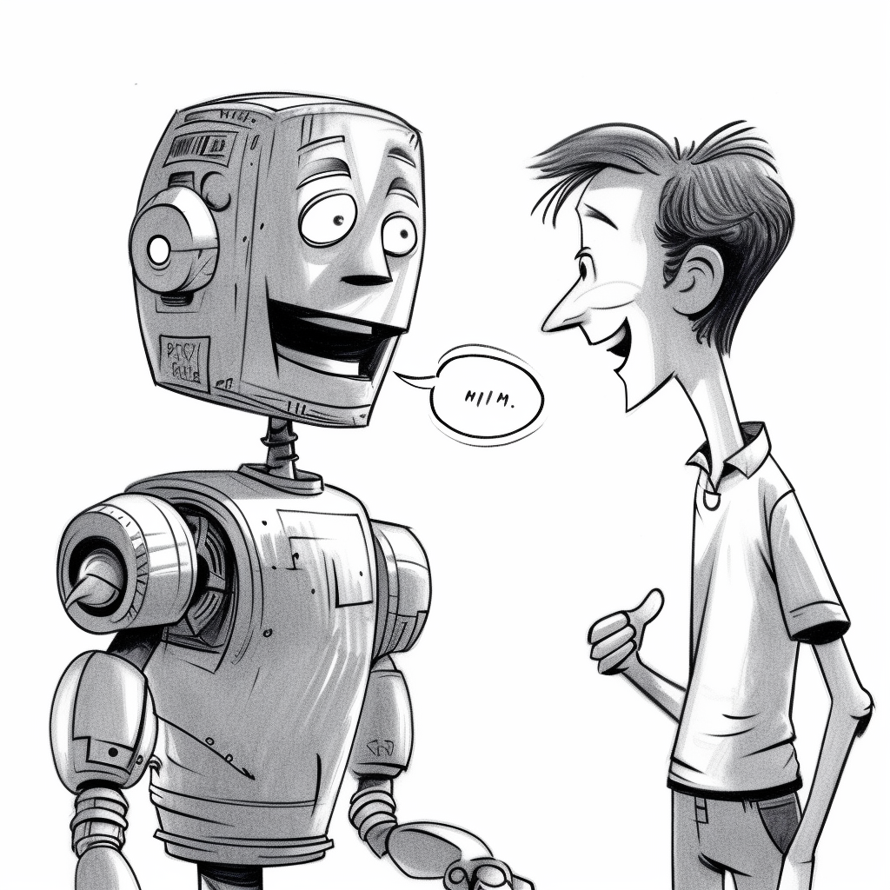
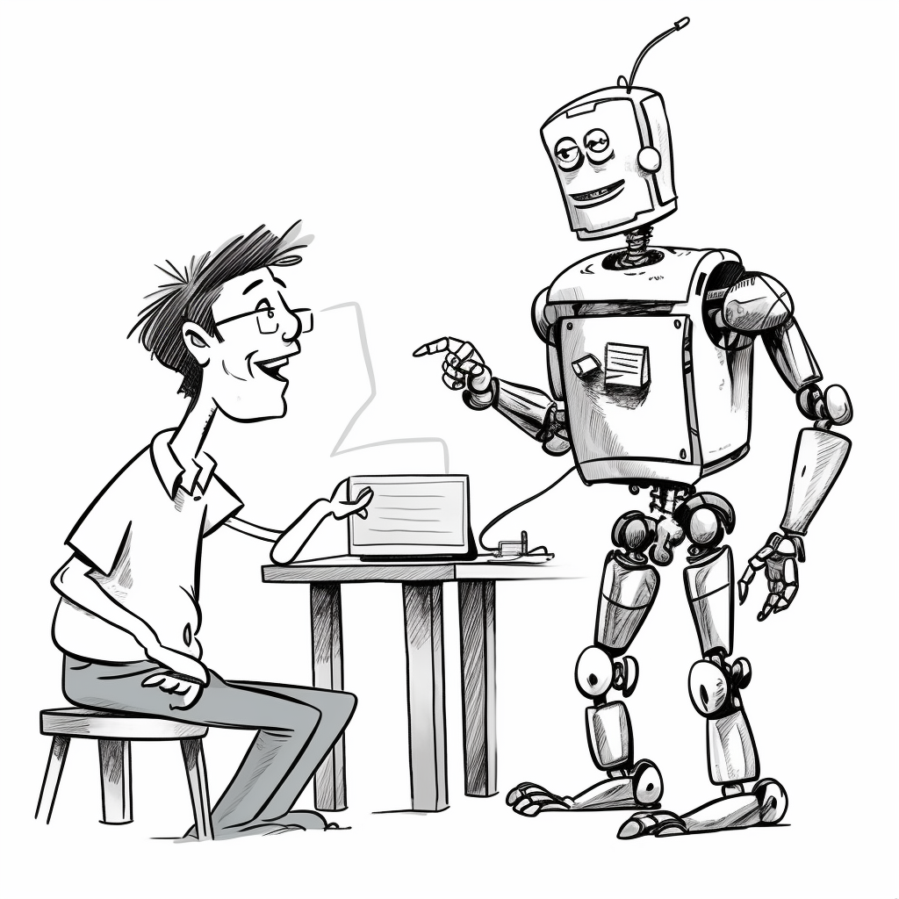
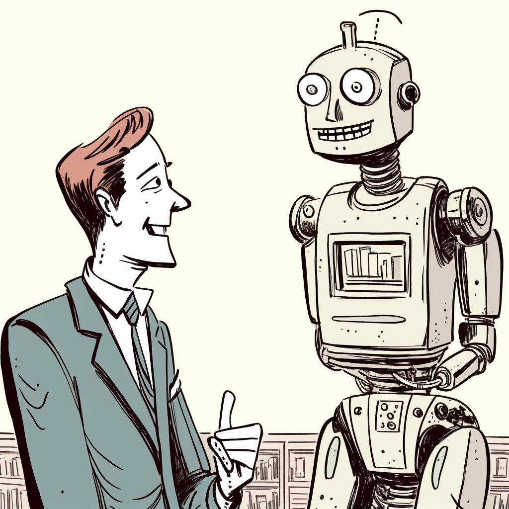
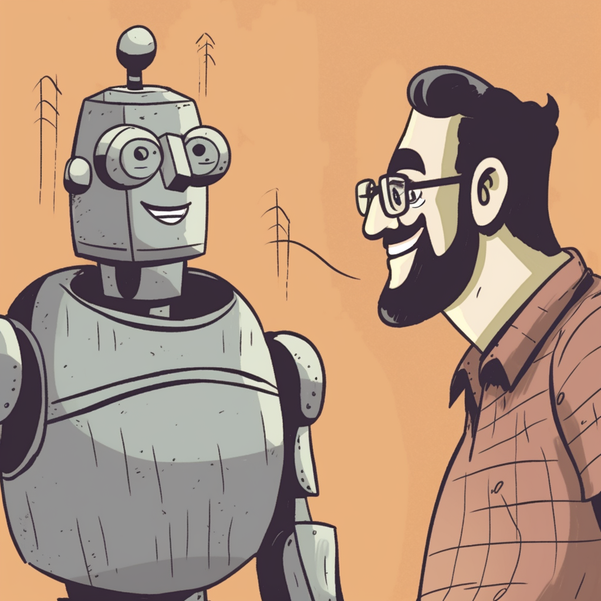

# Dialogue Dreamland 🤖💬

A Unity project that uses [ChatGPT](https://openai.com/blog/chatgpt/) to give NPCs personalities. It is targeted at a WebGL build that can be used in a browser.

  # [**Play ▶️**](https://p-v-z.github.io/DialogueDreamland/WebGL/)

  You will need your own [ChatGPT API](https://platform.openai.com/account/api-keys) key to play 🗝️

  

    
    
    
    
  

   🚧 This project is a work in progress 🚧
   
   

## Project Contents
### **Unity version:** [2021.3.20f1](./ProjectSettings/ProjectVersion.txt)

**Important:**
The purchased assets in this project are not contained in this repository. For a list of assets not included in this repository, see [Not included❗](#not-included)
 

### **Tools**

- [ChatGPTWrapper](https://github.com/p-v-z/ChatGPT-Wrapper-For-Unity) - Submodule to a fork of [ChatGPT-Wrapper-For-Unity](https://github.com/GraesonB/ChatGPT-Wrapper-For-Unity) by [GraesonB](https://github.com/GraesonB).

### **Unity Packages**

- [Cinemachine](https://unity.com/unity/features/editor/art-and-design/cinemachine) to manage the camera.
- [Unity Addressables](https://docs.unity3d.com/Manual/com.unity.addressables.html) to load assets at runtime.
- [Unity Input System](https://docs.unity3d.com/Manual/com.unity.inputsystem.html) to handle input.
- [Unity TextMeshPro](https://docs.unity3d.com/Manual/com.unity.textmeshpro.html) to render text.
- [UI Toolkit](https://docs.unity3d.com/Manual/UIElements.html) to create the UI.

### **Not included❗**

The following paid assets from the [Unity Asset Store](https://assetstore.unity.com/) are not included in this repository, but are **required to run the project**. If you would like to use this project, you will need to purchase and import the assets into the following folder structure inside `/DialogueDreamland/Assets/`:

- `DDAssets/`
  - [Mega Animations Pack](https://assetstore.unity.com/packages/3d/animations/mega-animations-pack-162341)
  - [Character Controller Pro](https://assetstore.unity.com/packages/tools/physics/character-controller-pro-159150)
  - [POLYGON City - Low Poly 3D Art by Synty](https://assetstore.unity.com/packages/3d/environments/urban/polygon-city-low-poly-3d-art-by-synty-95214)
  - [POLYGON Icons Pack - Low Poly 3D Art by Synty](https://assetstore.unity.com/packages/3d/gui/polygon-icons-pack-low-poly-3d-art-by-synty-202117)
- `Plugins/`
  - [Odin Inspector and Serializer](https://assetstore.unity.com/packages/tools/utilities/odin-inspector-and-serializer-89041)
  - [DOTween](https://assetstore.unity.com/packages/tools/animation/dotween-hotween-v2-27676)

## Upcoming Features
- Chat UI
  - Replace UI Toolkit logic with js interop UI
  - Style HTML UI
- World UX
  - Fix colliders and layers so that camera doesn't clip through the floor or walls.
- Build framework to define formulated base instructions to be given to bots, before and after
- Add settings UI to modify gfx settings

  
Made by <a href="https://github.com/p-v-z">Petrie van Zyl</a>

