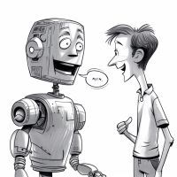

# 🤖 Dialogue Dreamland 💬

Dialogue Dreamland is a Unity project that uses [ChatGPT](https://openai.com/blog/chatgpt/) to give NPCs unique personalities in a WebGL build designed for browser use. 

<br>

<div align="center">

  # [**Play ▶️**](https://p-v-z.github.io/DialogueDreamland/WebGL/)

  You will need your own [ChatGPT API](https://platform.openai.com/account/api-keys) key to play 🗝️

  <div class="image-container">
    
    
    
    
  </div>

  <br>🚧 This project is a work in progress 🚧
</div>

# 📖 Table of Contents 
- [🚀 Introduction](#-introduction)
- [🎥 Showcase](#-showcase)
- [💾 Installation](#-installation)
- [📅 Upcoming Features](#-upcoming-features) 
- [💡 Future Ideas](#-future-ideas)
- [🤝 Contribution Guidelines](#-contribution-guidelines)
- [🏅 Credits](#-credits)
- [📝 License](#-license)

# 🚀 Introduction 
Welcome to Dialogue Dreamland, an immersive and innovative Unity project that harnesses the power of OpenAI's ChatGPT to breathe life into non-player characters (NPCs) in a WebGL build accessible right from your browser. By integrating state-of-the-art natural language processing technology, this project delivers engaging, interactive dialogues and unique NPC personalities, creating a dynamic and captivating gaming experience unlike any other. Dive into the world of Dialogue Dreamland and witness the fusion of artificial intelligence and game development come alive.

# 🎥 Showcase 
This section highlights some of the key technical features and design choices that make Dialogue Dreamland a unique and engaging project.

## ChatGPT Integration
Dialogue Dreamland uses [ChatGPT](https://openai.com/blog/chatgpt/) to generate responses to player input. ChatGPT is a state-of-the-art natural language processing model that uses deep learning to generate human-like responses to text prompts. 

## WebGL Build
WebGL is a platform that allows you to create interactive 3D content for the web. The project uses WebGL to create a browser-based game that can be played right from your browser. 

## CI/CD Pipeline
This project makes use of [game-ci](https://game.ci/), a GitHub Action that allows you to build your Unity project. The project is automatically built and deployed to GitHub Pages on every push to the `main` branch. See [github/workflows/main.yml](./.github/workflows/main.yml) for more details.

## Unity's JavaScript Interop for Emoji Handling
The project uses [Unity's JavaScript Interop](https://docs.unity3d.com/Manual/webgl-interactingwithbrowserscripting.html) to handle UI issues with emojis, as it is much easier to handle emojis in HTML than with Unity. There is a UI built into the project that can be used to test in Editor (without the HTML UI), it is not used in the WebGL build.  

## Unity Packages
- [Cinemachine](https://unity.com/unity/features/editor/art-and-design/cinemachine) to manage the camera.
- [Unity Addressables](https://docs.unity3d.com/Manual/com.unity.addressables.html) to load assets at runtime.
- [Unity Input System](https://docs.unity3d.com/Manual/com.unity.inputsystem.html) to handle input.
- [Unity TextMeshPro](https://docs.unity3d.com/Manual/com.unity.textmeshpro.html) to render text.
- [UI Toolkit](https://docs.unity3d.com/Manual/UIElements.html) to create the UI.

## Tools
This project includes a submodule, [ChatGPTWrapper](https://github.com/p-v-z/ChatGPT-Wrapper-For-Unity), a fork of [ChatGPT-Wrapper-For-Unity](https://github.com/GraesonB/ChatGPT-Wrapper-For-Unity) - which is a wrapper for the [ChatGPT API](https://openai.com/blog/chatgpt/) that allows you to use it in Unity.

# 💾 Installation

## Prerequisites
- Unity version [2021.3.20f1](./ProjectSettings/ProjectVersion.txt) or higher 🎮
- [ChatGPT API Key](https://platform.openai.com/account/api-keys) 🗝️
- Purchased  [Excluded Assets❗](#excluded-assets)

## Excluded Assets❗
<span style="color: red;">**Important:**</span>
The following **paid assets** from the [Unity Asset Store](https://assetstore.unity.com/) are **not included** in this repository, but are **required to run the project**. If you would like to use this project, you will need to purchase and import the assets into the following folder structure inside `/DialogueDreamland/Assets/`:

- `DDAssets/`
  - [Mega Animations Pack](https://assetstore.unity.com/packages/3d/animations/mega-animations-pack-162341)
  - [Character Controller Pro](https://assetstore.unity.com/packages/tools/physics/character-controller-pro-159150)
  - [POLYGON City - Low Poly 3D Art by Synty](https://assetstore.unity.com/packages/3d/environments/urban/polygon-city-low-poly-3d-art-by-synty-95214)
  - [POLYGON Icons Pack - Low Poly 3D Art by Synty](https://assetstore.unity.com/packages/3d/gui/polygon-icons-pack-low-poly-3d-art-by-synty-202117)
- `Plugins/`
  - [Odin Inspector and Serializer](https://assetstore.unity.com/packages/tools/utilities/odin-inspector-and-serializer-89041)
  - [DOTween](https://assetstore.unity.com/packages/tools/animation/dotween-hotween-v2-27676)

## Setup

### 1. Clone the repository
You can clone the repository with the following command:
```bash
git clone https://github.com/p-v-z/DialogueDreamland.git
```

### 2. Import the excluded assets 
Import the [Excluded Assets❗](#excluded-assets) using Unity's package manager, place the assets into the following folder structure `/DialogueDreamland/Assets/DDAssets/`. Import the plugins (Odin and DOTween) into `/DialogueDreamland/Assets/Plugins/`.

### 3. Install submodule
Clone [ChatGPTWrapper](https://github.com/p-v-z/ChatGPT-Wrapper-For-Unity) (or a fork of it) into the `/Assets/Scripts` folder of the project.

You should now be able to open the project and run it in the Unity Editor. If you have any issues, please feel free to reach out.

# 📅 Upcoming Features
- World UX
  - Fix colliders and layers so that camera doesn't clip through the floor or walls.
  - When you exit conversation, NPC should wave as it generates a 'goodbye' response.
    - Then the conversation should be summarized and stored somewhere, to be recalled next time you interact with the NPC
- Build framework to define formulated base instructions to be given to bots, before and after
- Add settings UI to modify gfx settings
- Make AI more human-like
  - Make them move around every now and then, maybe have a sit on the bench animation

# 💡 Future Ideas
- Make dialogue trigger changes in the world. For example, and NPC can serve as a guard to a door, and if you convince them to let you through, the door will open.
- Add a 'memory' system, where you can recall past conversations with NPCs.

# 🤝 Contribution Guidelines 
If you would like to contribute to this project, please feel free to fork the repository and submit a pull request. If you have any questions, please feel free to reach out.

# 🏅 Credits   
At the core of this project sits [ChatGPTWrapper](https://github.com/p-v-z/ChatGPT-Wrapper-For-Unity), which is a fork of [GraesonB](https://github.com/GraesonB)'s project - grattitude to them 🙏.

# 📝 License
This project is licensed under the MIT License - see the [LICENSE](./LICENSE) file for details. 

<br>

<div align="center">
  <p>Made by <a href="https://github.com/p-v-z">Petrie van Zyl</a></p>
</div>
